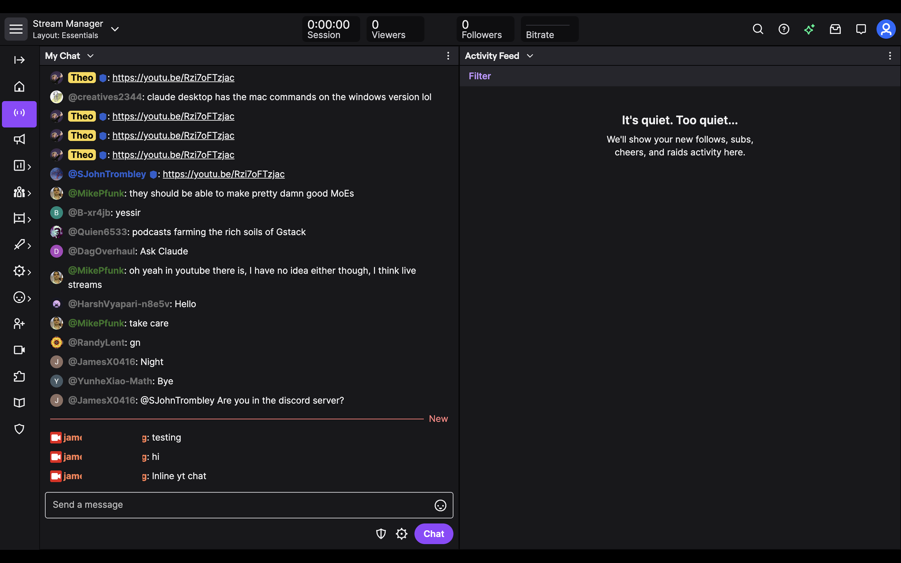

# ChatLink

Local bridge that opens a YouTube live chat in Puppeteer, bootstraps YouTube's internal `youtubei` live chat feed, and exposes normalized chat events on `localhost` for a userscript or extension.



## Run

1. Install dependencies:

```bash
bun install
```

2. Start the bridge with a YouTube stream URL:

```bash
bun run src/main.ts --yt-url 'https://www.youtube.com/watch?v=VIDEO_ID'
```

Or pass only the video ID:

```bash
bun run src/main.ts --yt-id VIDEO_ID
```

Resume the last locally saved history before reconnecting:

```bash
bun run src/main.ts --yt-id VIDEO_ID --resume
```

3. Add the userscript to Tampermonkey or Violentmonkey

- copy [examples/twitch-bridge.user.js](/Users/4980/Projects/sandbox/chatlink/examples/twitch-bridge.user.js:1) into your userscript manager
- keep the bridge running while Twitch is open
- open the normal Twitch stream page: `https://www.twitch.tv/<channel>`

The userscript reads the Twitch channel login from the current URL and asks the local bridge for:
- live YouTube events over `/events`
- recent Twitch IRC history over `/timeline` and `/twitch/messages`

Useful flags:

- `--yt-url`: YouTube stream or live chat URL. Quote it in `zsh`.
- `--yt-id`: YouTube video ID
- `-r`, `--resume`: reload the last saved `.chatlink/history.json` snapshot on startup
- `--port`: localhost port, default `8787`
- `--host`: bind address, default `127.0.0.1`
- `--poll-ms`: minimum polling interval, default `1500`. The collector also respects YouTube's continuation timeout.
- `--headful`: open Chromium visibly instead of headless

## Endpoints

- `GET /health`
- `GET /messages`
- `GET /events`
- `GET /timeline?channel=<twitch-login>`
- `GET /twitch/messages?channel=<twitch-login>`

`/events` is a Server-Sent Events stream. Event names:

- `message_add`
- `message_update`
- `message_delete`

## Notes

- The collector uses YouTube's internal `youtubei/v1/live_chat/get_live_chat` feed instead of scraping rendered DOM nodes.
- The bridge also listens to Twitch IRC via `@tmi.js/chat` so it can timestamp recent native Twitch messages with `tmi-sent-ts` and use those as ordering anchors.
- Delete handling is based on structured live chat actions such as item deletion, item replacement with tombstones, item removal, and delete-by-author events.
- The bridge persists chat state to `.chatlink/history.json`. Use `--resume` to preload that snapshot after restarts.
- The userscript prefers SSE for live YouTube updates and falls back to polling only when the browser blocks the stream.
- Recent Twitch-native DOM changes are observed lightly to refresh anchor metadata, but the userscript no longer rerenders all mirrored YouTube rows on every Twitch message.
- The userscript handles Twitch SPA channel changes in-place, so switching streams in the same tab no longer requires a full reload.
- If a native Twitch anchor row is added or removed, the userscript refreshes recent Twitch IRC history and incrementally reanchors existing YouTube rows.
- `youtubei` is an internal web endpoint, not a stable public API. Expect occasional breakage when YouTube changes its web client.
- Twitch ordering is still best-effort. Native Twitch rows are aligned against recent IRC history, which is much better than a greedy text match but still depends on Twitch's visible DOM.
- The Twitch userscript in `examples/twitch-bridge.user.js` depends on Twitch's current DOM structure, so selectors there may still need adjustment when Twitch changes its UI.
- Some streams may show consent or age gates before chat becomes readable. Those cases are not handled yet.
